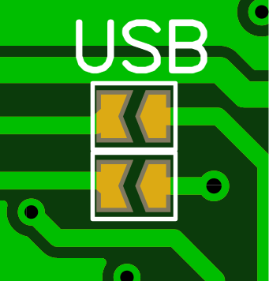
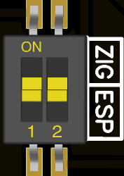

      

        

          
        

    

          
        

		

          
        

      

	  

      

      

    

## Features

- Wide range of Zigbee Modules (CC2652P, CC2652RB, etc)
- <b> 2 WORKING MODES: </b> LAN Coordinator or USB Coordinator/Router
- BOOT,FLASH,RESET Buttons
- 2 LED for indication [Custom firmware](https://github.com/jethome-ru/zigbee-firmware/tree/master/ti/coordinator/cc2652)
- Communicates via USB or LAN network with [Z2M](https://www.zigbee2mqtt.io/) and [ZHA](https://www.home-assistant.io/integrations/zha/)
- SMA port for an external antenna
- Easy programming with [ZigStar Multi Tool](/radio-docs/zigstar-multi-tool/#zigstar-multi-tool).No external programmer needed! 
- Plug & Play, comes pre-flashed

## Revisions

There are 3 version of Zigbee LAN Gateway,what are tested: 
- [RF-STAR RF-BM-2652P2 - 20dBm](https://github.com/mercenaruss/zigstar_gateways/raw/main/files/Gerbers/LAN%20Gateway/Gerber_WT32_RF-BM-2652P2.zip) 
- [Ebyte E72-2G4M20S1E  - 20dBm](https://github.com/mercenaruss/zigstar_gateways/raw/main/files/Gerbers/LAN%20Gateway/Gerber_WT32_E72-2G4M20S1E.zip)  
- [Ebyte E72-2G4M05S1F  - 5dBm](https://github.com/mercenaruss/zigstar_gateways/raw/main/files/Gerbers/LAN%20Gateway/Gerber_WT32_E72-2G4M05S1F.zip)[^1] 

!!! INFO
    - RF-STAR RF-BM-2652P2 recommended
	  - PCB thickness 1.2mm is recommended
	

## Bill of Materials

EasyEDA Generated BOM,you can order on [LCSC](https://lcsc.com) directly - [BOM](https://github.com/mercenaruss/zigstar_gateways/blob/main/files/BOM/BOM_WT32_RF-BM-2652P2.csv)

| Designator  | Name  | Footprint | Quantity |
| :------------|:---------------|:-----|:--------:|
| U1|[RF-BM-2652P1/P2](https://letyshops.com/r/aliexpress-c83c7878b18b)| | 1 |
| U2|[WT32-ETH01](https://letyshops.com/r/aliexpress-73b6cc1c03c9) |N/A| 1 |
| U3 | CH340C|SOP-16 |1|
| U4 | AMS1117-3.3|SOT-223 |1|
| R1 | 10 kohm|SMD 0805 |1|
| R2,R3 | 1 kohm|SMD 0805 |2|
| R4,R5 | 5.1 kohm|SMD 0805 |2|
| R6,R7 | 22 ohm|SMD 0805 |2|
| C1| 10uF|SMD_L3.5-W2.8|1|
| C2,C4| 100nF|SMD 0805|2|
| C3| 22uF|SMD_L3.5-W2.8|1|
| L1,L2| RED/GREEN LED|SMD 0805|2|
| SBL,RST,BOOT|PUSH BUTTON |SMD_L3.9-W3.0-P4.45|3|
| USB| TYPE-C|USB-C_SMD-TYPE-C-31-M-12|1|
| CON| [STACKABLE HEADER 13 PIN](https://letyshops.com/r/aliexpress-09c274fbb012) |2.54x13P|1|
| ANT| [SMA ANTENNA PORT 1.2mm](https://letyshops.com/r/aliexpress-e6704ce906c0)|SMA EDGE|1|

Next items are not available on LCSC,you can get them on Aliexpress:

| Name  | Shop 1 | Shop 2 |
| :------------|:---------------|:-----|
| WT32-ETH01| [CLICK](https://letyshops.com/r/aliexpress-a4dd8609c8d4)| [CLICK](https://letyshops.com/r/aliexpress-401d07dc02d1) |
| RF-STAR RF-BM-2652P1/P2|[CLICK](https://letyshops.com/r/aliexpress-dbe513b72282) | [CLICK](https://letyshops.com/r/aliexpress-1f3e1a35e82d) |
| Ebyte E72-2G4M20S1E | [CLICK](https://letyshops.com/r/aliexpress-b25ea4b8642a)| [CLICK](https://letyshops.com/r/aliexpress-00563b7dcf47) |
| Ebyte E72-2G4M05S1F | [CLICK](https://letyshops.com/r/aliexpress-dd63f3c1afdc)| [CLICK](https://letyshops.com/r/aliexpress-c8b5adc0e26c) |
| RP-SMA Antenna PCB Connector 1.2mm | [CLICK](https://letyshops.com/r/aliexpress-7507f61580c3)| N/A |
| RP-SMA Antenna Female - Inner hole |[CLICK](https://letyshops.com/r/aliexpress-81d294a1360f)| [CLICK](https://letyshops.com/r/aliexpress-5ebae68206ac) |
| STACKABLE FEMALE HEADER 13 PIN| [CLICK](https://letyshops.com/r/aliexpress-fb2fa1673785) | [CLICK](https://letyshops.com/r/aliexpress-09c274fbb012) |

## Options

In order to use your LAN Gateway in USB Mode(without connection to WT32-ETH01): 
Solder jumpers, labeled J1/USB or change default DIP switch position

!!! danger "DIP Switch Positions"
    - <b>ON</b> for USB Mode
	  - <b>OFF</b> for LAN Mode 

    Both switches should be in the same position.
  
{: style="height:20%;width:20%" loading=lazy} {: style="height:15%;width:15%" loading=lazy} 

## Firmware

Help on choosing correct firmware for your device is located [HERE](/radio-docs/quick-start/#step-2-download-the-correct-firmware-for-your-device)

## Flashing

* [YAML Config](https://github.com/mercenaruss/zigstar_gateways/blob/main/files/ESP-HOME/zigstar-gw-lan.yaml) 
* [WT32-ETH01 Firmware ESP-Home](https://github.com/mercenaruss/zigstar_gateways/raw/main/files/ESP-HOME/zigstar-gw-lan.bin)  
* [ZigStar Firmware](https://github.com/xyzroe/ZigStarGW-FW/releases)[^2]  
* ESP-HOME flashing guide - [ESP-HOME](/radio-docs/esp-home/) 
* ZigStar flashing guide - [ZigStar Firmware](/radio-docs/flash-zigstargw/) 
* Zigbee Module flashing guide - [ZigStar Multi Tool](/radio-docs/zigstar-multi-tool/#zigstar-multi-tool)) 

## Downloads
 - [Gerbers](https://github.com/mercenaruss/zigstar_gateways/tree/main/files/Gerbers)
 - [STL Case](https://github.com/mercenaruss/zigstar_gateways/tree/main/files/STL)
 - [Schematics (pdf)](https://github.com/mercenaruss/zigstar_gateways/tree/main/files/Schematics)
 - [LCSC BOM File](https://github.com/mercenaruss/zigstar_gateways/tree/main/files/BOM)

## Video

*English subtitles available

1. Ethernet Zigbee ZigStar Gateway, installing multiple zigbee2mqtt 

	<iframe width="560" height="315" src="https://www.youtube-nocookie.com/embed/KBEaVZyvSgY" title="YouTube video player" frameborder="0" allow="accelerometer; autoplay; clipboard-write; encrypted-media; gyroscope; picture-in-picture" allowfullscreen></iframe>

2. Server redundancy with Zigbee2MQTT on Zigbee LAN Coordinator Zigstar 

	<iframe width="560" height="315" src="https://www.youtube-nocookie.com/embed/g7BpjCrOhk8" title="YouTube video player" frameborder="0" allow="accelerometer; autoplay; clipboard-write; encrypted-media; gyroscope; picture-in-picture" allowfullscreen></iframe>
	
[^1]: **Not recommended for new assembly.**
[^2]: **All forces will be used for this firmware, ESPHOME debugging and development is depreceated**