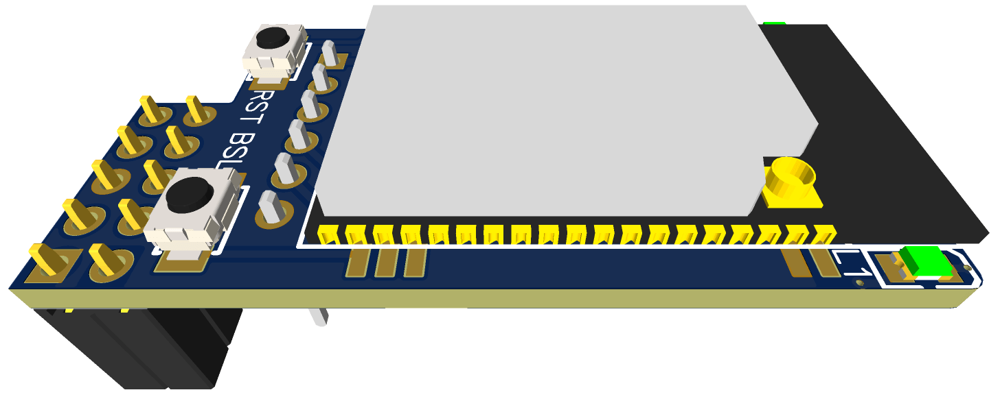

{: style="height:60%;width:60%" loading=lazy}

## Features

- [TI CC2652P](https://www.ti.com/product/CC2652P)SimpleLink™ 2.4 GHz Multiprotocol Wireless MCU targeting Zigbee,Bluetooth 5.1 Low Energy,Thread + 19.5-dBm high-power amplifier
- Support RF-BM-2652P1 and RF-BM-2652P2 Module from RF-STAR,with CC2652P on board
- BSL,RST Buttons
- 2 LED for indication
- Compatible with [Z2M](https://www.zigbee2mqtt.io/) and [ZHA](https://www.home-assistant.io/integrations/zha/)
- IPX port for an external antenna
- Self-programming via [cc2538-bsl](https://github.com/JelmerT/cc2538-bsl). No external programmer needed! Push BSL button to trigger this mode.

## Bill of Materials:

EasyEDA Generated Boom,you can order on [LCSC](https://lcsc.com)directly - [BOOM](https://github.com/mercenaruss/zigbee-stick-v4/blob/main/files/BOM_ZigStar_Shield.csv)

| Designator  | Name  | Footprint | Quantity |
| :------------|:---------------|:-----|:--------:|
| U1| RF-BM-2652P1/P2| | 1 |
| U2|AMS1117-3.3 |SOT-223| 1 |
| R1 | 10 kohm|SMD 0805 |1|
| R2,R3 | 1 kohm|SMD 0805 |2|
| C1| 10uF|SMD_L3.5-W2.8-R-RD|1|
| C2| 22uF|SMD_L3.5-W2.8-R-RD|1|
| C3| 100nF|SMD 0805|1|
| L1,L2| RED/GREEN LED|SMD 0805|2|
| SBL,RST|PUSH BUTTON |SMD_L3.9-W3.0-P4.45|2|
| JTAG| PIN HEADER 5 PIN|2.54x5P|1|
| H1| FEMALE HEADER 2x5 PIN|2.54 2x5P|1|

Next item is not available on LCSC,you can get it on Aliexpress:

 - [RF-BM-2652P1/P2](https://letyshops.com/r/aliexpress-f6e2c6d280d5)
 
## Firmware

Module is compatible with [Z2M](https://www.zigbee2mqtt.io/).
Firmware [CC1352P2_CC2652P_launchpad_*.zip](https://github.com/Koenkk/Z-Stack-firmware/tree/master/coordinator/Z-Stack_3.x.0/bin). 
Default TX Power is <b>5dbm</b>. It can be adjusted in Z2M config section:

    experimental:
      transmit_power: 5

Available TX power values: -20,-18,-15,-12,-10,-9,-6,-5,-3,0,1..5,14..20

## Downloads
 - [Gerber](https://github.com/mercenaruss/zigbee-stick-v4/tree/main/files/gerber)
 - [Schematics (pdf), Revision 1](https://github.com/mercenaruss/zigbee-stick-v4/tree/main/files/schematics)
 - [LCSC Boom File](https://github.com/mercenaruss/zigbee-stick-v4/blob/main/files/BOM_ZigStar_Shield.csv)
