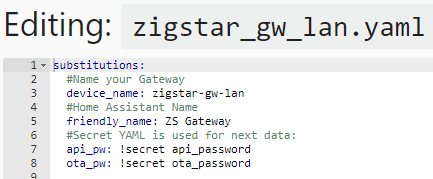
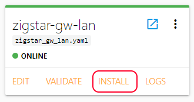
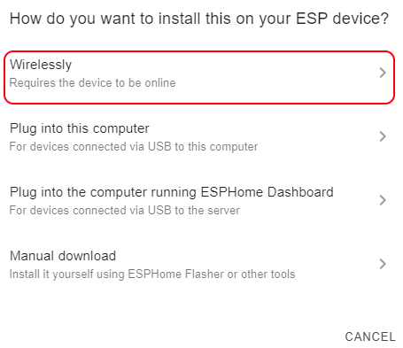
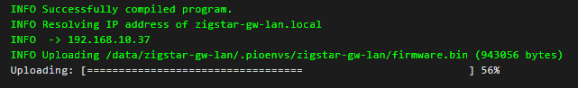
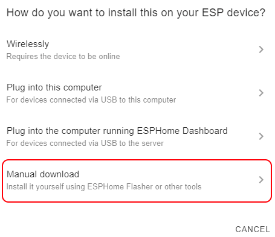
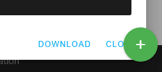

# ESP-HOME

In order to change default setting for ESP-HOME firmware, please follow next guides.

## Install ESP-HOME 

Choose from 2 optional avalaible at the moment:

=== "HA Supervised"

	It's using Home Assistant add-on, install instruction are found [HERE](https://esphome.io/guides/getting_started_hassio.html)
	
=== "Standalone"

	It can be installed barematel or using docker( personally using on windows ), follow instructions from [HERE](https://esphome.io/guides/getting_started_command_line.html)
	
!!! info	
	For both cases is required to download .yaml for your PCB

## Substitutions

For example you want to change gateway hostname, friendly name in HA, your API and OTA passwords.

In this case edit just next items,at the beggining of .yaml file:

{ loading=lazy }

## Static IP

In order to make your device have the same IP each time after reboot, you have 2 ways to achieve this: 

- setup static ip in your router config 
- modify .yaml file.

{ loading=lazy }

## Generate and install updated firmware

{ loading=lazy }

!!! danger
	Any error in ip configuration could cause the gw to not connect and require to be flashed with Serial to USB converter( applies to Wifi Gateway)
!!! danger
	After changing IP parameters, OTA update it's not gonna work,until firmware is flashed to ESP module,using Manual Download.
		
=== "Wirelessly"

	If you made changes only in subtitutions section,then just press Install button in ESP-HOME interface,followed by Wirelessly.
	
	{ loading=lazy }
	
	{ loading=lazy }
	
=== "Manual Download"

	After changing IP parameters, OTA update it's not gonna work,until firmware is flashed to ESP module manually.
	
	1. Press Manual Download
	
		{ loading=lazy }
	
	2. Debug console confirm that firmware was built and Download button appear in righ bottom corner.
	
		{ loading=lazy } { loading=lazy }
	
	3. Open your gateway address in browser and update firmware:
	
		{ loading=lazy }
	

