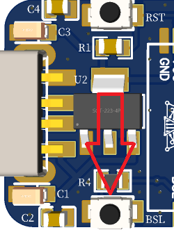
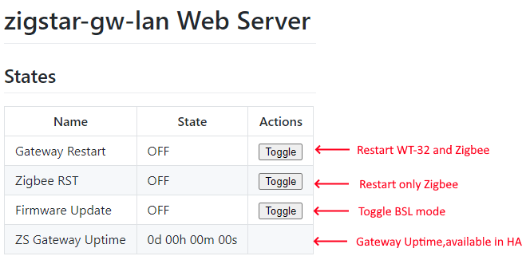
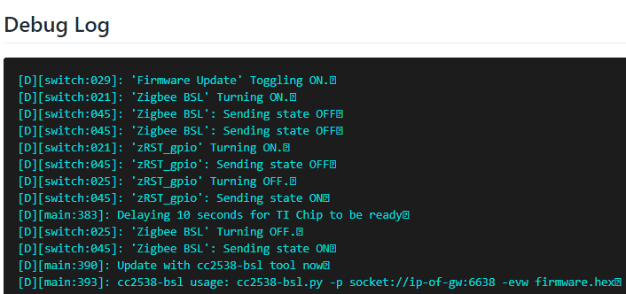

# Flash Firmware using JelmerT's serial bootload tool

[JelmerT's serial bootload tool](https://github.com/JelmerT/cc2538-bsl)is a cross-platform Python script that allows you to flash firmware on TI's newer chips.<br>
All ZigStar boards are supported by cc2538-bsl.py.

## Installation

  - Install [python](https://www.python.org/downloads/)
  - Use ```python --version``` to be sure, that you are running python 3 or above!
  - If you are **NOT** running **3.4** or higher, you need to install `pip`, too.
  - Install dependencies with ```pip install pyserial intelhex```
  - Download the [cc2538-bsl.py] file or just clone the repo.<br>

Copy and paste the command into your terminal.

=== "Linux(Debian/Ubuntu)"
    ```
	sudo apt update && sudo apt-get install python3-pip
	```
	```
	wget -O cc2538-bsl.zip https://codeload.github.com/JelmerT/cc2538-bsl/zip/master && unzip cc2538-bsl.zip
	```
	```
	sudo pip3 install pyserial intelhex
	```   
=== "MacOS"
    Python3 should already be shipped with macOS,if no then follow below procedure:

	Download and extract cc2538-bsl: 
	```
	curl --output cc2538-bsl.zip https://codeload.github.com/JelmerT/cc2538-bsl/zip/master && unzip cc2538-bsl.zip
	```
	Install required dependencies: 
	```
	/usr/bin/python3 -m pip install --user pyserial intelhex
	```	
=== "Windows"

    Download [Python for Windows](https://www.python.org/downloads/)and install. After installation verify Python if its installed by running `python -V` in Command Prompt.

	If you receive a message similar to `Python is not recognized as an internal or external command, operable program or batch file.`, this means Python is either not installed or the system variable PATH hasn’t been set. You’ll need to launch Python from the folder in which it is installed or adjust your system variables to allow it to be launched from any location.

	Download the [zipped code](https://github.com/JelmerT/cc2538-bsl/archive/master.zip)and extract to a folder.

	Install required dependencies: 
	```
	pip install pyserial intelhex
	```
    !!! tip
        Please use the [Power Shell](https://docs.microsoft.com/en-us/powershell/)to have the best user experience. If you encounter permissions issues, ensure that you are running your terminal as an administrator.

## Determine the USB port/ IP address

Plug your device in and ensure that device is recognised by your OS:

=== "Linux(Debian/Ubuntu)"

    On linux, use this:
	```
	ls -l /dev/serial/by-id
	```
	Issue `dmesg` and observe the device enumeration:

	```Shell
	[152343.203201] usb 1-1.4: new full-speed USB device number 5 using dwc_otg
	[152343.336384] usb 1-1.4: New USB device found, idVendor=1a86, idProduct=7523, bcdDevice= 2.62
	[152343.336400] usb 1-1.4: New USB device strings: Mfr=0, Product=2, SerialNumber=0
	[152343.336409] usb 1-1.4: Product: USB2.0-Serial
	[152343.338315] ch341 1-1.4:1.0: ch341-uart converter detected
	[152343.341440] usb 1-1.4: ch341-uart converter now attached to ttyUSB0
	```
	
=== "MacOS"

    On macOS find the device using:
	```
	ls /dev/tty.* 
	```
	Issue `dmesg` and observe the device enumeration:
	```
	IOUserSerial::AppleUSBCHCOM::<private>: 127 0x6000013e4058
	IOUserSerial::<private>: 456 0x6000013e4058
	IOUserSerial::<private>: 41 0x6000013e4058
	DK: AppleUSBCHCOM-0x1000030ea::start(IOUSBHostInterface-0x1000030e5) ok
	```
	
=== "Windows"

    On windows, use this in a Powershell or go to Device Manager

	```
	$comports = Get-WMIObject Win32_SerialPort; $comports | Get-PnpDeviceProperty -InstanceId {$_.pnpdeviceid} -Keyname DEVPKEY_Device_BusReportedDeviceDesc | ForEach-Object { foreach($comport in $comports) { if ($comport.pnpdeviceid -eq $_.instanceid) { new-object psobject -property  @{COMPORT = $comport.deviceid; 'Device-Name' = $_.data} } } }
	```
	The drivers for CH340 should be automatically be picked up,check under "Ports (COM & LPT)" in Device Manager:

	{ loading=lazy }
	
	If you need to install the drivers manually, go [HERE](http://www.wch.cn/downloads/CH341SER_ZIP.html)for official drivers.
	
!!! TIP
        Double-check by undocking the device again.

!!! info
		For network device find out IP or hostname.
		
## Put your device in BSL mode

Please follow the following instructions to put your device in BSL mode:

=== "USB Coordinator"

	- Unplug your stick from the host
	- Press the `BSL/FLASH` pushbutton and keep holding while plugging the device back into the host
  
		{: style="height:15%;width:15%" loading=lazy} {: style="height:15%;width:15%" loading=lazy}

	- Give it a few seconds for the device to settle and set up and release the BSL button
	- Your stick should now be in ROM bootloader mode

	<ins>It's very important that you press and hold the BSL button **before** plugging it in to the host and release it **after a few seconds**.</ins>
	!!! note
		cc2538-bsl.py and .exe supports "Auto-BSL", now you can skip the BSL pushbutton press for flashing boards.
		
		Just follow normal firmware procedure using cc2538-bsl.py or cc2538-bsl.exe. ( Boards using CH340E does not support Auto-BSL! )

=== "Network Coordinator "

	- Access device by IP or hostname using your browser
	- Click <b>Firmware Update</b>  initiate the bootloader (BSL) mode for the module:
	
	{ loading=lazy }
	
	- Watch the Debug output and when promted go to next step.
	
	{ loading=lazy }
		
## Flash firmware

To flash firmware, run:

=== "Option 1 - cc2538-bsl.exe"

	```
	./cc2538-bsl.exe -p PORT -evw FIRMWARE
	```
	...where `PORT` is the serial port your board is connected to.
	```
	./cc2538-bsl.exe -p socket://ip_or_localdns_name:6638 -evw FIRMWARE
	```

=== "Option 2 - Python"

	```
	python cc2538-bsl.py -p PORT -evw FIRMWARE
	```
	...where `PORT` is the serial port your board is connected to
	```
	python cc2538-bsl.py -p socket://ip_or_localdns_name:6638 -evw FIRMWARE
	```
	
(see [above](#determine-the-usb-port)) and `FIRMWARE` is the hex file you want to flash (see [here](/radio-docs/quick-start/#step-2-download-the-correct-firmware-for-your-device) for help on choosing firmware).

!!! INFO
    -p: will select the port<br>
    -evw: will erase,write and check firmware
	
!!! warning 
	It is crucial that you download the correct firmware for your stick as using the wrong firmware will disable the BSL and you will need an external debugger / programmer to flash your stick again.</p>
	
## Additional:

### Erase device

To completely erase the device flash, run:

=== "Option 1 - cc2538-bsl.exe"

	```
	./cc2538-bsl.exe -p PORT -e
	```
	...where `PORT` is the serial port your board is connected to.
	```
	./cc2538-bsl.exe -p socket://ip_or_localdns_name:6638 -e
	```

=== "Option 2 - Python"

	```
	python cc2538-bsl.py -p PORT -e
	```
	...where `PORT` is the serial port your board is connected to.
	```
	python cc2538-bsl.py -p socket://ip_or_localdns_name:6638 -e
	```


### Clearing NVRAM

During the flashing process, the coordinator's memory (NVMEM) may contain arbitrary data, which may in some cases prevent NVMEM recovery from the backup.

=== "Zigbee2MQTT"
    The coordinator's memory is cleared by the `zStackEraseAllNvMem.js` script, which is usually located in this directory:
	```
	/opt/zigbee2mqtt/scripts 
	```
	The command line will look something like this:
	```
	node zStackEraseAllNvMem.js /dev/ttyUSB0
	```
	```
	node zStackEraseAllNvMem.js socket://ip_or_localdns_name:6638
	```
=== "Zigpy-ZNP"

	Download and install zigpy-znp: 
	```
	pip install zigpy-znp
	```
	Erase your device's NVRAM entries to fully reset it:
	```
	python -m zigpy_znp.tools.nvram_reset /dev/serial/by-id/your-radio
	```
	```
	python -m zigpy_znp.tools.nvram_reset socket://ip_or_localdns_name:6638
	```
	Some warnings are normal, as not all entries will be present in every device.

!!! info
	At the end of the flashing, you may need to unplug-plug your device or press RST.