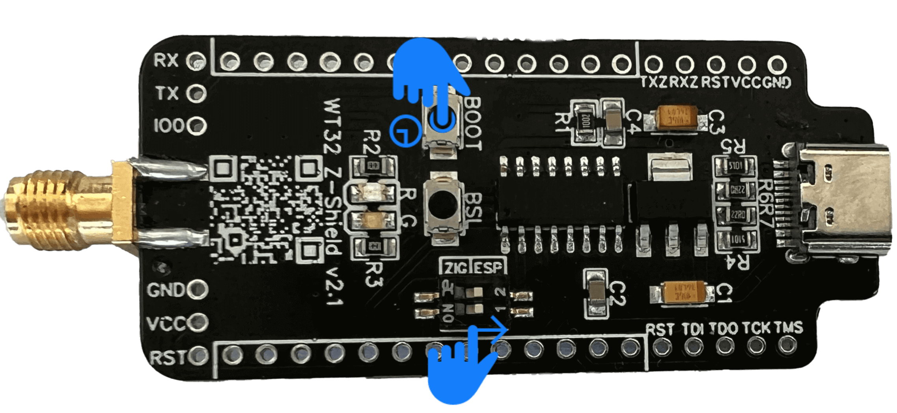

# Flash ZigStar LAN Gateway Firmware

## Requirements

- [NodeMCU PyFlasher](https://github.com/marcelstoer/nodemcu-pyflasher/releases/latest/download/NodeMCU-PyFlasher.exe)
- [ZigStarGW-FW](https://github.com/xyzroe/ZigStarGW-FW/releases/latest/)[^1]
- USB-C Type Cable

## Flash firmware

### Step 1: Activate Flash Mode

To enable flash mode on ESP32, BOOT button/switch should be pressed before you plug in your USB cable. 
Press and HOLD for 5 seconds after you plugged in your USB cable to PC.

*Be sure DIP switch is in ESP Mode( or jumpers are not soldered)

{: style="height:50%;width:50%" loading=lazy}

### Step 2: Firmware flashing

Start the previously loaded NodeMCU pyFlasher Tool, and select the identified serial port from the list, as well as the downloaded firmware file.

      

		

          
        

        

          
        

        

          
        

      

	  

      

      

    

???+ done
	
	At this point you are up and running. 
	Access your device by IP or hostname using your browser.

???+ note

    Flashing is required only once if you assembly device yourself or move from ESP-HOME.
	Use [ZigStarGW_vx.x.x.full.bin](https://github.com/xyzroe/ZigStarGW-FW/releases/latest/)for [NodeMCU PyFlasher](https://github.com/marcelstoer/nodemcu-pyflasher/releases/latest/download/NodeMCU-PyFlasher.exe)

### Step 3: ZigBee Firmware Update ( Optional )

In case you want to update/install your Zigbee Firmware, follow [ZigStar MultiTool Instructions](/radio-docs/zigstar-multi-tool/)

[^1]: Download [ZigStarGW_vx.x.x.full.bin](https://github.com/xyzroe/ZigStarGW-FW/releases/latest/)if you are using [NodeMCU PyFlasher](https://github.com/marcelstoer/nodemcu-pyflasher/releases/latest/download/NodeMCU-PyFlasher.exe)
[^2]: Will be downloaded .bin , is specially for OTA update.

## Update your firmware

To update your existing firmware[^2] just go to your browser and access your device by IP or hostname.

      

		

          
        

        

          
        

		

          
        

      

	  

      

      

    

???+ done
	
	Congratulations, you are on last firmware.[^2]

    
