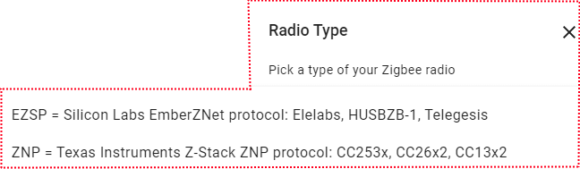
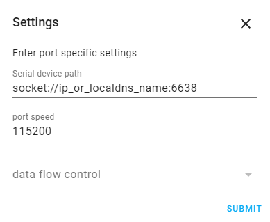

# Choose your side

[Zigbee2MQTT](https://www.zigbee2mqtt.io/) has support for TI CC2652P/CC2652RB chips used on this boards.<br>
ZHA Supports both TI and SiLabs chips. 

## First Steps

Choose your device instructions:

=== "USB Stick v4"

	1. Power on your USB Stick
	2. Make sure that the USB-serial bridge drivers are installed and your device is recognised (instructions [here](/radio-docs/flash-cc-bsl/#determine-the-usb-port-ip-address)).
	3. Configure your software to access the device.	
		
	=== "Zigbee2MQTT"
	
		Currently only TI Chips are supported by Z2M( CC2652P/CC2652RB ).
		
		With the correct serial port identified, edit your Zigbee2MQTT `configuration.yaml` :
		```
		serial:
			port: /dev/ttyUSB0  (change this if it is different on your machine)
		```
	
	=== "ZHA"
		3.1. Add the ZHA Integration via the Add Integrations option:
	
		{: style="height:50%;width:50%" loading=lazy}

		3.2. From dropdown menu select your stick:
	
		{: style="height:50%;width:50%" loading=lazy}
	
		3.3. Choose the device path of USB Stick and wait for installation to complete.
		
		- In case the autodetection fails,a manual setup menu will be displayed.
	
		!!! info
			Enter <b>device path</b> and <b>Port Speed:115200</b> and Software Flow Control leave empty.
	
		{: style="height:50%;width:50%" loading=lazy}
		
		!!! info
			If ZHA is unable to connect to the USB adapter then try re-plugging in the USB adapter or try moving it to another USB-port.
	
=== "LAN/PoE Gateway"
	
	1. Connect the gateway to a ethernet cable which has access to your local network.
	2. Power on the gateway with a Type C cable.
	3. Determine the device's ip address,if your local network supports .local mdns addresses, the devices can be reached that way:
		```
		zigstargw.local
		```
		or by static ip.
	
		!!! info
			If its used Static IP Address - be sure it is reserved in your router,so will not change after reboot.

	4. Configure your software to access the device.<br>	
		
	=== "Zigbee2MQTT"
	
		Currently only TI Chips are supported by Z2M( CC2652P/CC2652RB ).
		
		With the correct IP or hostname identified, edit your Zigbee2MQTT `configuration.yaml`:
		```
		serial:
			port: 'tcp://ip_or_hostname:6638'
		```
	

	=== "ZHA"
		4.1. Add the ZHA Integration via the Add Integrations option:
	
		{: style="height:50%;width:50%" loading=lazy}

		4.2. From dropdown menu select Manual:
	
		{: style="height:50%;width:50%" loading=lazy}
	
		4.3. Select the Radio type for your chip:
	
		{: style="height:50%;width:50%" loading=lazy}
	
		!!! info
			For TI based gateways select ZNP<br>
			For SiLabs based gateways select EZSP
		
		4.4. Enter <b>socket://ip_or_hostname:6638</b> and <b>Port Speed:115200</b> and Software Flow Control leave empty.
	
		{: style="height:50%;width:50%" loading=lazy}
	
## Troubleshooting

### Zigbee2MQTT: Error Network Commissioning Timeout (panID or extendedPanID already exists nearby)
This error is discussed in these two threads: [first](https://github.com/Koenkk/zigbee2mqtt/issues/10858) and [second](https://github.com/tube0013/tube_gateways/issues/95).  
According to the first thread, the most possible issue cause this error is: `zigbee2mqtt will always use the same, default extendedPanId unless you set it to something else in the config file`
```yaml
advanced:
  pan_id: GENERATE
  ext_pan_id: [0x01, 0x02, 0x03, 0x04, 0x05, 0x06, 0x07, 0x08]
  network_key: GENERATE
```
According to the second thread, the users propose to start without antennas or routers nearby: `Try unscrewing the antenna during startup or unplug any near by routers temporarily.`

Try to do abovementioned as well as start ZHA just to test your device:

1. Go to Home Assistant
2. Click `Settings`
3. Go to `Devices & Services`
4. Click `Add integration` (right bottom corner)
5. Find «Zigbee Home Automation», click on it;
6. Between two options «Add Zigbee device» and «Zigbee Home Automation» choose `Zigbee Home Automation`;
7. Select serial port window - `Enter manually`
8. Radio type window - `ZNP = Texas Instruments Z-Stack ZNP … `
9. Serial port settings window:
	- Serial device path: « socket://192.168.1.105:6638 », where 192.168.1.105 is IP address of your ZigStar Adapter;
	- port speed left by default 115200;
	- data flow control undefined (it does not matter for LAN adapters)
10. Press `Submit`.
11. Network formation window - `Erase network settings and form a new network`
12. Wait for Zigbee network and try to add some Zigbee end-device (e.g. sensor etc)

If ZHA starts - means that the problem in communication between Zigbee2MQTT and Z-Stack firmware, flashed to the adapter. To solve it - try steps above ZHA part.


