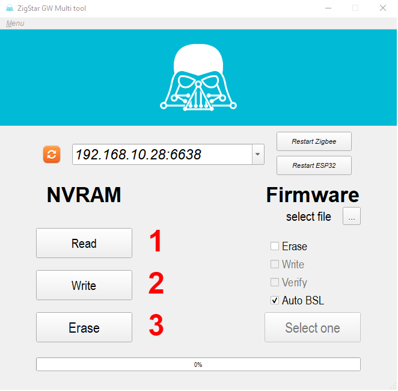

# ZigStar Multi Tool

[ZigStar Multi Tool](https://github.com/xyzroe/ZigStarGW-MT)is GUI tool designed for easy work with ZigStar LAN GW and USB Stick and packed into single executable file. 
You can get started without installing Python and the required modules - just download and open.

*All ZigStar boards( LAN or USB) are supported by Multi Tool.(now also supports sticks, regardless of the manufacturer) 

[Download](https://github.com/xyzroe/ZigStarGW-MT/releases/){ .md-button , target=_blank}

## Features
- Read / Write / Erase NVRAM memory of Zigbee module
- Write / Verify / Erase firmware of Zigbee module
- Backdoor Serial Loader turns on automatically
- Manual restart of  Zigbee module or ESP32 is available
- Comaptible with OS X, Windows and Ubuntu
  
## Screenshots

<table>
<tr> 
<td width="50%">

<b>Windows</b>

</td>
<td width="50%">

<b>OS X</b>

</td>
</tr>
</table>

## Instructions:

### Identify Port

On main ap window press refresh button in order to identify your USB Stick port or LAN GW address. 
and choose your device from drop-down list:

{: style="height:50%;width:50%" loading=lazy}

### Firmware update

1. Choose your .hex file from you PC
2. Choose required options,usually is Erase,Write and Verify
3. Press Start for flashing process(not all USB dongle entering BSL mode,depending on manufacturer)*

{: style="height:50%;width:50%" loading=lazy}

*All ZigStar Sticks and LAN GW are automaticaly entering BSL mode

### NVRAM Tools

When is coming to firmware bugs,problems with zigbee network NVRAM tool come at help.

1. Backup your ZigBee NVRAM for future use or restore to another Dongle/LAN Coordinator
2. Write you existing backup back to Dongle/LAN Coordinator
3. Erase you Dongle/LAN Coordinator NVRAM for a fresh install

{: style="height:50%;width:50%" loading=lazy}

## Video description

*English subtitles available

<iframe width="560" height="315" src="https://www.youtube.com/embed/o8u1tMEa9lA" title="YouTube video player" frameborder="0" allow="accelerometer; autoplay; clipboard-write; encrypted-media; gyroscope; picture-in-picture" allowfullscreen></iframe>

